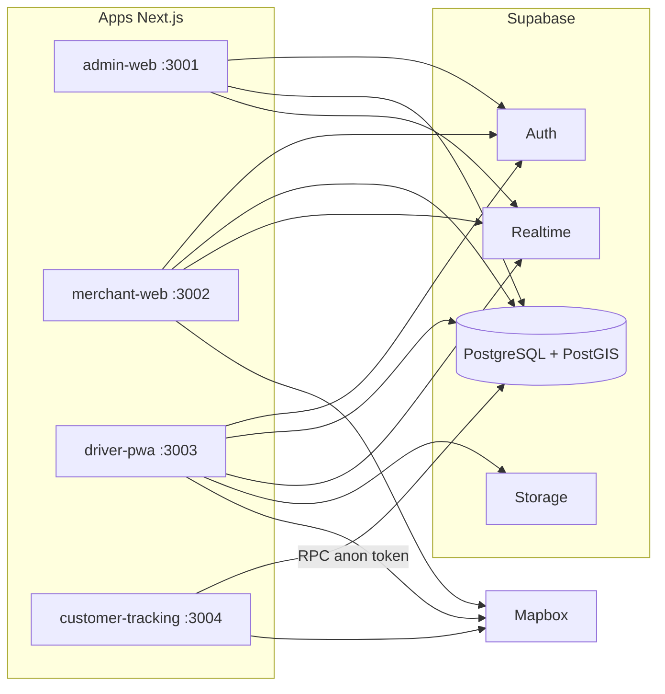

# Arquitectura — RapideX / PedidosGo

## Visión

Plataforma de delivery que conecta **comercios** con **repartidores independientes**.  
Negociación de tarifas tipo inDrive, backend 100% **Supabase**, mapas **Mapbox**, 4 apps **Next.js** en monorepo.

Marca configurable vía `NEXT_PUBLIC_APP_*` y tabla `app_settings` (seed actual: **RapideX**).

## Diagrama lógico

## Aplicaciones

| App | Puerto | Usuarios | Auth |
|-----|--------|----------|------|
| `admin-web` | 3001 | Superadmin | Obligatoria + rol admin |
| `merchant-web` | 3002 | Comercio | Obligatoria |
| `driver-pwa` | 3003 | Repartidor | Obligatoria + PWA |
| `customer-tracking` | 3004 | Cliente final | Pública (token) |

## Paquetes (`packages/`)

| Paquete | Rol |
|---------|-----|
| `config` | Marca, puertos, cabeceras de seguridad |
| `types` | Tipos compartidos |
| `validation` | Zod + tests Vitest |
| `ui` | Button, Input, AppShell, NotificationBell |
| `supabase` | Browser / server / middleware |
| `maps` | Mapbox geocoding, directions, MapView |
| `auth` | Helpers de roles |
| `shared` | Utilidades |
| `e2e` | Playwright smoke |

## Backend Supabase

### Migraciones

`supabase/migrations/20260721000001` … `00021`

Orden típico: extensiones → identidad → merchants → drivers → orders → locations/finance → auth helpers → PostGIS → RLS → Storage → fases de producto (3–14).

### Capas clave

| Capa | Ejemplos |
|------|----------|
| Tablas | `orders`, `delivery_*`, `drivers`, `notifications`, `driver_wallets` |
| RLS | Políticas por rol / branch / driver |
| RPC | `create_manual_order`, `accept_delivery_offer`, `advance_delivery_status`, `get_public_tracking`, `submit_driver_rating` |
| Realtime | `orders`, `delivery_*`, `driver_current_locations`, `notifications` |
| Storage | Documentos driver, evidencia (bucket) |

### Flujo de un pedido

1. Merchant crea pedido (`create_manual_order`) y publica  
2. Drivers ven jobs y ofertan  
3. Merchant acepta → `delivery_assignments` + `tracking_token` + PIN  
4. Driver avanza estados + GPS  
5. Al `delivered` → comisión + wallet  
6. Cliente sigue en `/t/[token]`  
7. Merchant califica; notificaciones in-app a lo largo del flujo  

## Seguridad (resumen)

- RLS en tablas sensibles  
- Tracking solo por token + expiry + rate limit  
- `service_role` solo servidor  
- Cabeceras HTTP (CSP, X-Frame-Options, etc.) en las 4 apps  
- Secrets fuera de Git (`.env.local`)  

## Infraestructura objetivo

| Pieza | Uso |
|-------|-----|
| GitHub | Código + CI |
| Vercel | 4 deploys (Root Directory por app) |
| Supabase Cloud | Auth, BD, Realtime, Storage |
| Mapbox | Mapas / rutas |

## Fuera de alcance actual (tablas listas, sin UI completa)

- Webhooks de comercio  
- Tickets de soporte  
- Evidencia fotográfica de entrega (UI)  
- Edge Functions (carpeta vacía)  
- Push FCM / WhatsApp (prohibidos / no usados por diseño)  
